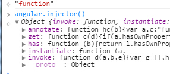

## 必备基础知识
js中基础知识必须有比较深入的理解
1：原型
2：作用域
3：闭包

## AngularJS的启动过程
启动过程的流程图
启动方式1：自动启动（实例1）;
启动方式2：手动启动（实例2）;
启动方式3：多个ng-app(实例3);
绑定jQuery;
全局对象angular（injector方法);

#### 启动方式1：自动启动（实例1）;
ng-app指令

#### 启动方式2：手动启动（实例2）;
```
var myModule=angular.module("MyModule",[]);
myModule.controller('myCtrl',['$scope',function($scope){
    function($scope){
        $scope.gameName="tom hihi";
    }
}]);
/**
* 手动启动angular
*/
angular.element(document).ready(function(){
    angular.bootstrap(document,['MyModule']);
});
```
在这里主要是通过`angular.bootstap()`来实现手动启动的过程。

#### 多个ng-app(实例3);
一个页面可以有多个ngapp 
但是这些ngapp要是平行的结构，不能嵌套

不要尝试在一个页面中使用多个ngapp（这个很少使用）

### 启动过程
有4个主要的过程
1：绑定jquery
2:publishExternalAPI
3:angularInit


## 依赖注入原理分析:Provider与Injector
1：为什么要依赖注入？
2：复习：ng中最简单的依赖注入例子（实例时内联注入）
3：ng的三种注入方式（推断式注入、标注式注入，内联注入）
4：直接使用$injector(一般很少使用)
5:provider模式与ng实现
6：provider/factory/service/constant/value/decorator
7:内置的provider分析
8：injector源码分析

### 1：为什么要依赖注入？

### 2.1推断式注入
```
//推断型注入，函数的参数名称必须要和被注入对象相同
var myModule=angular.module('MyModule',[]);
var myCtrl=function($scope){
    $scope.gameName="hell tome";
}
myModule.controller('MyCtrl',MyCtrl);
```

* 局限性
现在前端开发一般都会使用构建工具，对于前端代码进行压缩。
`推断型注入，函数的参数名称必须要和被注入对象相同`
在压缩的过程中，可能会改变函数的参数名称。因此在可能会引入一些bug。
因此这种方式不推荐使用

### 2.2标注式注入
```
//推断型注入，函数的参数名称必须要和被注入对象相同
var myModule=angular.module('MyModule',[]);
var myCtrl=function($scope1){
    $scope1.gameName="hell tome";
}
myCtrl.$injector=['$scope'];
myModule.controller('MyCtrl',MyCtrl);
```
这种方式也比较麻烦
### 2.3内联注入
```
var myModule=angular.module('MyModule',[]);
myModule.controller('myCtrl',['$scope',function($scope1){
   $scope1.gameName="tome1";
}]);
```
这种方式一般是我们常用的方式。
### $injector
>没有搞清楚 $injector 如同$scope在源码中是如何启动的？

但是对于`angulr.injector()`有一点了解
1:publishExternalAPI
```
 function publishExternalAPI(angular){
     extend(angular, {
     ...
     'injector': createInjector,
     ...
     });
 }
```
2:createInjector
```
function createInjector(modulesToLoad){
...
   return {
    invoke: invoke,
    instantiate: instantiate,
    get: getService,
    annotate: annotate
   };
}
```
因此我们在控制台发现`injector`具有的方法如下


#### injector.invoke


#### injecotr.annotate
查看一个函数的参数，最后以数组的形式返回
这个的实现也比较好玩，是通过function的toString(),然后再利用正则表达式实现的。
 
### provider/factory/service/constant/value/decorator
```
  function provider(name, provider_) {
   if (isFunction(provider_) || isArray(provider_)) {
    provider_ = providerInjector.instantiate(provider_);
   }
   if (!provider_.$get) {
    throw Error('Provider ' + name + ' must define $get factory method.');
   }
   return providerCache[name + providerSuffix] = provider_;
  }
  function factory(name, factoryFn) { return provider(name, { $get: factoryFn }); }
  function service(name, constructor) {
   return factory(name, ['$injector', function($injector) {
    return $injector.instantiate(constructor);
   }]);
  }
  function value(name, value) { return factory(name, valueFn(value)); }
```
我们发现这么几个方法的基础都是provider

## 指令的执行过程分析

## $scope与双向数据绑定分析
