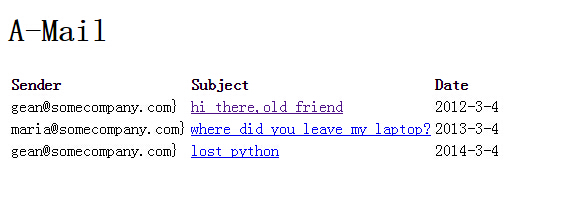
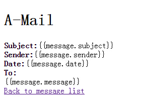

index.html
```
<!DOCTYPE html>
<html ng-app="AMail">
<head lang="en">
    <meta charset="UTF-8">
    <title></title>
    <script type="text/javascript" src="../lib/angular.min.js"></script>
    <script type="text/javascript" src="../lib/angular.route.min.js"></script>
    <script type="text/javascript" src="controllist.js"></script>
</head>
<body>

<h1>A-Mail</h1>
<div ng-view></div>

</body>
</html>
```

list.html
```
<table>
    <tr>
        <td><strong>Sender</strong></td>
        <td><strong>Subject</strong></td>
        <td><strong>Date</strong></td>
    </tr>
    <tr ng-repeat="message in messages">
        <td>{{message.sender}}}</td>
        <td><a href="#/view/{{message.id}}">{{message.subject}}</a></td>
        <td>{{message.date}}</td>
    </tr>
</table>
```

detail.html
```
<div><strong>Subject:</strong>{{message.subject}}</div>
<div><strong>Sender:</strong>{{message.sender}}</div>
<div><strong>Date:</strong>{{message.date}}</div>

<div>
    <strong>To:</strong>
    <span ng-repeat="recipent in message.recipents">{{recipent}}</span>
</div>
<div>{{message.message}}</div>
<a href="#/">Back to message list</a>
```

controller.js
```
var aMailServices=angular.module('AMail',['ngRoute']);

//在URL、模块和控制器之间建立映射关系
function emailRouteConfig($routeProvider){
    $routeProvider.when('/',{
        controller:ListController,
        templateUrl:'list.html'
    }).when('/view/:id',{
        controller:DetailController,
        templateUrl:'detail.html'
    }).otherwise({
        redirectTo:'/'
    });
}
//配置我们的路由，以便AMail
aMailServices.config(emailRouteConfig);

//一些虚拟的邮件
messages=[{
            id:0,
            sender:'gean@somecompany.com',
            subject:'hi there,old friend',
            date:'2012-3-4',
            recipients:['greg@somecompany.com'],
            message:'hey,we should get together for lunch sometime and catch up'
            +'there are many things we should collaborate on this year'
        }, {
            id:1,
            sender:'maria@somecompany.com',
            subject:'where did you leave my laptop?',
            date:'2013-3-4',
            recipients:['greg@somecompany.com'],
            message:'hey,we should get together for lunch sometime and catch up'
            +'there are many things we should collaborate on this year'
        }, {
            id:2,
            sender:'gean@somecompany.com',
            subject:'lost python',
            date:'2014-3-4',
            recipients:['greg@somecompany.com'],
            message:'hey,we should get together for lunch sometime and catch up'
            +'there are many things we should collaborate on this year'
        }
];

//把我们的邮件发布给邮件列表模板
function ListController($scope){
    $scope.messages=messages;
}
//从路由信息（URL中解析出来）中获取邮件id，然后用它找到正确的邮件对象
/*
在这里$routeParams的作用是什么？为什么在这个DetailController控制器中可以使用到这个形参？
1：作用已经在【服务文档】中写明白了
2：

* */
function DetailController($scope,$routeParams){
    $scope.message=message[$routeParams.id];
}

```
最后的效果
首页的信息

点击链接之后的页面

