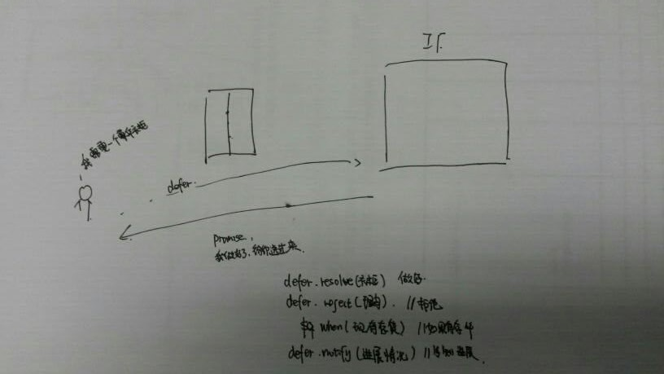
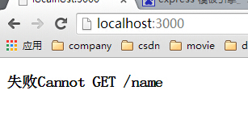
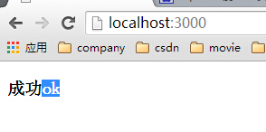
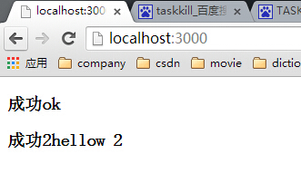
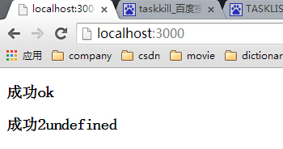
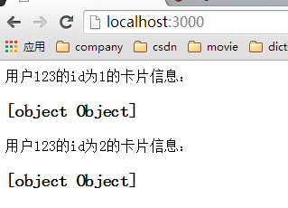
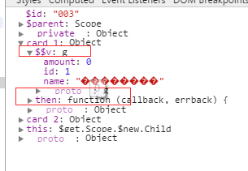

## 关于异步编程
在学习nodejs的时候异步编程就是一个难点。但是好在已经有了许多的框架。
**1：在处理异步编程中已经有哪些解决方案？**
      
      回调函数(ajax,在success，error，complete回调函数)
      事件发布/订阅模式 (在nodejs中有一个核心模块eventEmiiter)
      Promise/Deferred模式
      流程控制模式
    
**2：在nodejs中自己最喜欢的异步编程的处理方式？**

    使用第三方的模块：async模块，感觉这种方式更加的直观，而且使用起来比较方便。很喜欢这种方式。这种方式是流程控制方式中的一种。
    
## AngularJS是如何实现异步？
* 通过`$q服务`.其中`$q服务`是对`Promise异步编程模式`的一个简化实现版本。
* 在异步编程中最核心的就是回调了。因为有了回调函数，所以才构成了异步编程。
     * 1：什么之后执行回调：请求成功或者失败的时候
     * 2：执行什么回调：
     * 3： 回调执行的时候传入什么参数。
     
### 回调函数处理异步
```javascript
fetchUser(function(user){
  fetchUserPermissons(user,function(permisson){
    fetchUserListData(user,permission,function(List){
    //对于你想要的数据进行处理
    })
  })
})
```
**缺点：**
1：`代码的可读性`特别的差。感觉进入了噩梦模式
2：`错误的处理`难道在每一层的回调中都进行错误处理。这个会搞的代码一团糟糕
     
 
### Promise/Deferred模式
* promise编程基于commonJS规范
* 在CommonJS草案中已经抽象出了Promise/A、Promise/B，Promise/C,Promise/D这四种典型的异步Promise/Deferred模型。

**promise背后的概念**


* defer对象
    * defer对象（延期对象）。代表发起异步执行。
* Promise对象
    * promise是对异步编程的一种抽象。它是一个`代理对象`，代表一个必须进行异步处理的`函数返回的值`或`抛出的异常。`
    * promise对象（承诺对象）代表`回调执行体`。
  
**Promise/Deferred模式的优点和缺点**

* 优点：Promise/Deferred模式的API接口和抽象模型都十分的简洁。
* 缺点：对于不同的场景，都需要去封装和改造Deferred部分。然后才能得到简洁的接口。不过对待与defer，在angularJS已经帮我们封装，
这里不需要我们再过多的封装了。
  
## $q服务的API---promise在AngularJS中的实现 

#### $q服务
* $q.defer()---可以构建一个新的 `deffered 实例`。
* $q.all([promise1,promise2,...]):---
     当数组中的`每个单一promise对象都收到了成功通知`,这个`新的promise对象`也收到`成功通知`(回调参数是一个数组,数组中的各个值就是
     每个promise收到的data,注意顺序不是按照单个promise被通知的顺序,而是按照[promise1,promise2]这个数组里的顺序)
     当数组中的`某个promise对象`收到了`失败通知`,这个`新的promise对象`也收到`失败通知`,回调参数就是单个promise收到的失败通知的回调参数

#### 延迟接口 | Deferred API

**deffered 对象作用**
用来将 Promise 实例与 标记任务状态(执行成功还是不成功)的 API 相关联。
**deffered 对象的方法**

  * resolve(value) ――传入成功的 promise。
  * reject(reason) ――传入的promise,并提供原因 。
       在promise的.then(funciton(){})函数里面失败调用.作用是给.then()返回的下一个promise发送错误信息,并且给错误回调传入参数data
  * notify(value)  ――在 promise 执行的过程中提供状态更新。 这在 promise 被解决或拒绝之前可能会被多次调用。

**deffered 对象的属性**

  * promise �C {Promise} ―― 与延迟(deferred)相关联的 promise 对象。

#### 承诺接口 | Promise API

**promise对象的创建**
当创建 deferred 实例时会创建一个新的 promise 对象,并可以通过  deferred.promise 得到该引用
**promise 对象的目的**
是在 deferred 任务完成时,执行相应的执行体。
**promise 对象的方法**

* then(successCallback, errorCallback, notifyCallback) ――不管 promise 是被处理还是被拒绝, 一旦结果可用,then 就会尽快地异步调用 成功/错误 回调函数 只要结果是可用的。 调用回调函数时传递单个参数: 结果 或拒绝的理由。
 此外,notify 回调可能被调用 0到多次,以提供 提供一个进度指示,之前承诺解决或拒绝。
  这个方法 `返回一个新的promise 对象`, 根据 successCallback , errorCallback的返回值进行解决或拒绝 。 它还通过 notifyCallback 方法的返回值进行通知。 promise 不能从notifyCallback方法得到解决或拒绝 。
  如果有过多then方法：
  1：在第一个then方法中如果是`成功通知`的，则下一个then的successCallback的参数，是`上一个then()中successCallback的返回值`。
  2：在第一个then中是`失败通知`的，则一下一个then的errorCallback的参数，是最开始传递过来的参数。
* catch(errorCallback) ―― promise.then(null, errorCallback) 的快捷方式..
     如果defer发送的是`失败通知`，执行catch（）之后，下一个promise执行成功通知.`下一个promise对象的形参`就是catch回调的返回值.
     如果defer发送的是`成功通知`，跳过catch(),下一个promise执行成功通知，形参由defer传递。
* finally(callback) ――让你可以观察到一个 promise 是被执行还是被拒绝, 但这样做不用修改最后的 value值如果。 
                这可以用来做一些释放资源或者清理无用对象的工作,不管promise 被拒绝还是解决。 更多的信息请参阅完整文档规范.
             .finally也返回一个promise对象,和上面两个方法不同的是（不管通知成功与否，在finally中都会执行）,
             它为下一个promise对象发送的通知不一定是成功通知,而是传给finally的通知类型.
    如果defer发送的是`失败通知`,执行finally()之后，下一个promise执行失败通知，接收的参数是由defer得到的。
    如果defer发送的是`成功的通知`，执行完finally()之后。下一个promise执行成功通知，接收到的参数是上一个finnally的返回值。
            因为在 ES3版本的JavaScript中 finally 是一个保留字关键字,不能作为属性名,为了适配 IE8,您需要使用  promise['finally'](callback) 这种形式来调用该方法

#### 简单的例子
在html页面中
```
<!DOCTYPE html>
<html ng-app="Async">
<head lang="en">
    <meta charset="UTF-8">
    <title></title>
    <script src="../lib/angular.min.js"></script>
    <script src="controllist.js"></script>
</head>
<body>
<div ng-controller="promise">
</div>
</body>
</html>
```
在js代码中
```
var HttpREST=angular.module('Async',[]);
//基本例子
HttpREST.controller('promise',function($q,$http){
    /**
     * 1：创建一个defer对象
     * 2：创建一个defer对象对应的promise对象
     * 3：promise对象定义了成功回调函数，定义了失败回调函数
     * 4：对于promise发起通知
     * */
        //创建defer对象
    var defer=$q.defer();
    // 创建defer对象对应的promise对象
    var promise=defer.promise;
    //定义了成功之后的执行，和失败之后的执行
    promise.then(function(data){
        console.log('成功'+data);
    },function(data){
        console.log('失败'+data);
    });
    //对于promise发起通知
    defer.resolve('code_buny');
});
```

当调用defer.resolve('code_buny')的时候执行promise中成功的时候的回到函数，resolve函数中的参数就是回调成功执行的时候的参数。

#### 简单的例子--单次调用
html页面
```
<!DOCTYPE html>
<html ng-app="Async">
<head lang="en">
    <meta charset="UTF-8">
    <title></title>
    <script src="../../lib/angular.min.js"></script>
    <script src="../controllist.js"></script>
</head>
<body>
<div ng-controller="promise">
    <h3 ng-bind="name"></h3>
</div>
</body>
</html>
```
控制器中的js
```
var httpREST=angular.module('Async',[]);
//defer.resolve()  defer.reject()  defer.notify()
httpREST.controller('promise',function($q,$http,$scope){
    /**
     * 1:创建一个defer对象
     * 2：创建一个promise对象
     * 3：在promise中定义回调函数，成功的时候执行什么回调函数，失败的时候执行什么回调函数，度回函数
     * 4：定义一个$http的get请求。这个请求在成功的时候调用defer.reolve(res.data),在失败的时候调用defer.reject(res.data)
     * */

    var defer=$q.defer();
    var promise=defer.promise;
    promise.then(function(data){
        $scope.name='成功'+data;
    },function(data){
        $scope.name='失败'+data;
    },function(data){
        $scope.name='进度'+data;
    });

    $http({
        method:'GET',
        url:'/name'
    }).then(function(res){
        defer.resolve(res.data);
    },function(res){

        defer.reject(res.data);
    });

});

```
nodejs中的js
```
/**
 * Created by John on 2015-10-02.
 */
var express = require('express');
var url = require('url');
var path=require('path');
var swig=require('swig');
var app = express();
app.use(express.static(path.join(__dirname, 'public')));
//设置模块引擎
app.engine('html',swig.renderFile);
app.set('views', path.join(__dirname, 'views'));
app.set('view engine', 'html');

app.get('/name1',function(req,res){
    setTimeout(function(){res.send('ok')},2000)
});
app.get('/',function(req,res){
    res.render('index');
});

app.listen(3000);
console.log("Server runing at port: " + '3000' + ".");
```
1:如果后台没有**/name**的处理的时候得到的结果是


2：如果后台有**/name**的处理的时候得到的结果是


#### 简单的例子--多次调用
html页面中
```
```
在js中
```
var httpREST=angular.module('Async',[]);
//defer.resolve()  defer.reject()  defer.notify()
httpREST.controller('promise',function($q,$http,$scope){
    /**
     * 1:创建一个defer对象
     * 2：创建一个promise对象
     * 3：在promise中定义回调函数，成功的时候执行什么回调函数，失败的时候执行什么回调函数，度回函数
     * 4：定义一个$http的get请求。这个请求在成功的时候调用defer.reolve(res.data),在失败的时候调用defer.reject(res.data)
     * */

    var defer=$q.defer();
    var promise=defer.promise;
    promise.then(function(data){
        $scope.name='成功'+data;
        //这里的返回值传递给下一个then方法的形参
     //   return 'hellow 2';
    }).then(function(data){
        $scope.name2='成功2'+data;
    },function(data){
        //任何一个步骤中发生错误，都可以在这里处理
        $scope.name2="错误2"+data;
    });

    $http({
        method:'GET',
        url:'/name'
    }).then(function(res){
        defer.resolve(res.data);
    },function(res){

        defer.reject(res.data);
    });

});

```
在nodejs中
```
/**
 * Created by John on 2015-10-02.
 */
var express = require('express');
var url = require('url');
var path=require('path');
var swig=require('swig');
var app = express();
app.use(express.static(path.join(__dirname, 'public')));
//设置模块引擎
app.engine('html',swig.renderFile);
app.set('views', path.join(__dirname, 'views'));
app.set('view engine', 'html');

app.get('/name',function(req,res){
    setTimeout(function(){res.send('ok')},2000)
});
app.get('/',function(req,res){
    res.render('index');
});

app.listen(3000);
console.log("Server runing at port: " + '3000' + ".");
```


1：如果我没有在前面的then函数中return 一个值的话，后面的then函数中参数将没有

有return值的时候


没有return值的时候


2：任何一个步骤中发生错误，都可以在最后一个then方法的错误处理函数中进行处理。

#### 简单的例子--$resource与promise联合使用
在html中
```
<!DOCTYPE html>
<html ng-app="HttpREST">
<head lang="en">
    <meta charset="UTF-8">
    <title></title>
    <script src="../../lib/angular.min.js"></script>
    <script src="../../lib/angular-resource.js"></script>
    <script src="../controllist.js"></script>
</head>
<body>
<div ng-controller="Card">
    用户123的id为1的卡片信息：<h3 ng-bind="card_1"></h3>
    用户123的id为2的卡片信息：<h3 ng-bind="card_2"></h3>
</div>
</body>
</html>
```
在js中
```
/**
 * 1:创建一个依赖于ngResource的模块HttpREST
 * 2:对于HttpREST模块创建一个服务cardResource---需要$resource
 * 3:创建一个查询Card的工厂httpCard-----需要$q ,cardResource
 * 4:在这个工厂中返回的是对象列表，其中有一个getById,它通过cardResource.get()获取。
 * 5：创建HttpREST模块的控制器card。为$scope 对象添加上id为1的银行卡信息，id为2的银行卡信息。
 * */

/*
var httpREST=angular.module('HttpREST',['ngResource']);
httpREST.factory('cardResource',['$resouce',function($resouce){
    return $resouce('/card/user/:userId/:id',{
        userId:123,
        id:'@id'
    });
}]);

httpREST.factory('httpCard',['$q','cardResource',function($q,cardResource){
    return{
        getById:function(queryId){
            //这里有问题，defer对象的创建是需要通过$q

            var defer= $q.defer();
            cardResource.get({id:queryId},function(data){
                 defer.resolve(data);
            },function(res){
                defer.reject(res);
            });
            return defer.promise;
        }
    }
}]);

httpREST.controller('cardController',function($scope,httpCard){
//异步打印
    $scope.card_1 = httpCard.getById(1);
    $scope.card_1.then(function(){console.log($scope.card_1)});
    $scope.card_2=httpCard.getById(2);
});*/

var HttpREST = angular.module('HttpREST',['ngResource']);

HttpREST.factory('cardResource',function($resource){
    return $resource('/card/user/:userID/:id',{userID:123,id:'@id'},{charge:{method:'POST',params:{charge:true},isArray:false}})
});
HttpREST.factory('httpCard',function($q,cardResource){
    return {
        getById:function(cardID){
            var defer = $q.defer();
            cardResource.get({id:cardID},function(data,headers){
                defer.resolve(data);
            },function(res){
                defer.reject(res);
            });
            return defer.promise
        },
        query:function(){
            var defer = $q.defer();
            cardResource.query({},function(data,headers){
                defer.resolve(data);
            },function(res){
                defer.reject(res);
            });
            return defer.promise
        }
    }
});

HttpREST.controller('Card',function($scope,httpCard,cardResource){
    //通过id获取银行卡
    $scope.card_1 = httpCard.getById(1);
    //异步打印结果
     $scope.card_1.then(function(data){
         console.log(data);

     });

    $scope.card_2 = httpCard.getById(2);});


```
在nodejs中
```
/**
 * Created by John on 2015-10-02.
 */
var express = require('express');
var url = require('url');
var path=require('path');
var swig=require('swig');
var app = express();
app.use(express.static(path.join(__dirname, 'public')));
//设置模块引擎
app.engine('html',swig.renderFile);
app.set('views', path.join(__dirname, 'views'));
app.set('view engine', 'html');
/**
 * 1:模拟卡片的信息，cards
 * 2；定义获取某个具体的id的时候，返回的数据
 * 3：定义返回所有的路径的时候返回的数据
 *
 * */
var cards=[
    {
        id:1,
        name:'建设银行',
        amount:0
    },
    {
        id:2,
        name:'中国银行',
        amount:0
    },
    {
        id:3,
        name:'上海银行',
        amount:0
    }
];

//当为某一个具体的id的时候，返回该id对应的数据
app.get('/card/user/123/:id',function(req,res){
    var data=cards[req.params.id-1];
    res.send(data);
});

//返回所有的数据
app.get('/card/user/123',function(req,res){
    res.send(data);
});

app.get('/',function(req,res){
    res.render('index');
});
app.listen(3000);
console.log("Server runing at port: " + '3000' + ".");
```
**最后的结果**

**在控制台中**


card_1只有一个$$v属性和一个then方法,它并没有name属性,也没有amount属性,但是在视图中,<span>{{card_1['name']}}</span>
确实渲染了.虽然我没有看过源代码,但是可以推测,视图渲染card_1的时候,是使用了card_1的$$v对象来进行渲染的.所以访问card_1['name'],
其实是访问了card_1的$$v['name'].
```
$scope.updataCard = function(){
  $scope.card_1.name='工商银行';    //视图不会发生变化
  $scope.card_1.$save()            //card_1没有$save方法
};
```
发现直接操作card_1.name属性,虽然card_1的name属性确实发生了变化,但是,在视图中它并没有任何的变化.可见,视图对于promise对象,
监测的依然是它的$$v对象的属性的变化,而它自己的属性变化是没有任何反应的.
另外,card_1是promise对象,不是$resource返回的对象,card_1的$$v才是,所以,card_1当然也没有$save方法
如果我使用另外一种方式去更新的时候就好了
```
    $scope.save1=function(){
        $scope.card_1.$$v.name='gongshang bank2';
        $scope.card_1.$$v.$save();
    }
```
上面的代码存在的问题：
`$$v对象`是在请求已经得到响应,得到返回的数据的时候才有的,在没有得到响应前,`$$v`是undefined.所以,
如果在还没有得到响应前就执行了`save1函数`,这段代码就会有问题.so,最好的方法是放在promise的then方法的回调函数的参数里:
```
    $scope.save1=function(){
        $scope.card_1.then(function(data){
            data.name="gongshang bank3";
            data.$save();
        });
    }
```

**需要注意的地方**
* 在expres4中许多的内置的依赖包，需要单独下载，比如`body-parser`.否则的话，`req.body`这个属性不能使用
* 

参考文献：
http://www.cnblogs.com/liulangmao/p/3907571.html

代码位置：
https://github.com/crystalwm/Angular_demo/tree/master/AngularjsTutorial_cn/%E7%BB%83%E4%B9%A0/%24q%E5%92%8C%24promise

    