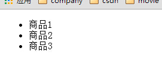

服务都可以作为控制器的参数，传递给控制器。
Angular内置的服务以$符号打头，你可以给服务随意起名字，但是，最好不要以$打头，以免引起命名冲突。
## 什么时候需要使用到服务
当你需要在多个控制器之间进行交互和共享状态的时候，这些服务就是一种很好的机制。
可以把在多个控制器复用的代码抽成一个服务
比方说：你从服务器端获取的数据需要在多个控制器中使用的时候，这个时候就可以把获取的数据放在服务中。
* 在angularJS中**业务逻辑**和**数据持久化**应该是要放在服务中的。

**servie的特性**

>servie都是`单例`的
>service由$injector负责实例化(不需要自己去实例化，你只需要声明即可，AngularJS的注射器会帮忙实例化)
>service在整个的生命周期存在，可以用来`共享数据`
>在需要使用的地方利用`依赖注入`机制注入service
>自定义的service需要写在内置的service后面
>内置service的命名以$符号开头，自定义的应该避免


## $scope
* 作用：它一般是控制器的形参，向这个对象添加属性或者方法(```数据模型```)。可以在```视图```中访问。
### $scope属性的创建
* 显示创建
    * $scope.count=5;
* 间接创建
    * 在```ng-click指令```中
    ```
    <button ng-click='count=3'> set count to 3</button>
    ```
    
    > 在表达式中设置属性值就和在控制器中设置属性值是一样的效果，是不是在控制器中也可以访问到这个属性$scope.count?
    
    * 在```ng-model指令```中
    
### $scope的方法
#### $scope.$watch(watchFn,watchAction,deepwatch)
* 你可以监视数据模型`单个属性`的变化，然后调用想应的处理函数。
* 你可以监视数据模型`数组`的变化，这个时候deepwatch需要设置为`true`
* 如果你需要随时的监控一个函数的变化的时候，把这个方法设置为`$scope对象`的方法就可以了
* `使用场合`当某个属性的值发生变化，需要`调用不同的处理函数`的时候，可以使用`$scope.$watch()`，它会让代码更加的好阅读，
   其实我觉得这个方法可能会在需要的时候使用吧
   
#### $scope.$apply()
  
## $location
* 作用：用来和浏览器的地址栏进行交互

## $route
* 作用:用来根据URL地址的变化切换视图
    
## $routeParams
* 作用：允许你去检索目前的`路由参数集合`。
* 需要注意的地方： $routeParams会在route完全成功更新之后修改。这意味着你不能在 route resolve函数中依赖$routeParams。
  在这个时候，你可以使用`$route.current.params`，来访问新的路由参数。
  
```
route:/view/:id
url: /view/1
//那么这个时候的路由参数集合为
 $routeParams ==> {id:'1'}
```

## $http服务
* 作用：它提供了一个可扩展的抽象方法列表，使得与服务器的交互更加的容易。它支持HTTP、JSONP和CORS方式。
它还包含了安全性支持，避免了JSON格式的脆弱性和XSRF(跨站请求伪造).它可以轻松地转换请求和响应数据，
甚至还可以实现简单的缓存。

如果想要详细了解$http的内容，

* 使用$http进行通信
```
$http.get('api/user',{
    params:{id:'5'}
}).success(function(data,status,headers,config){
//加载成功之后做的事情处理
}).error(function(){
//处理错误
});
```

#### $http服务的demo
js代码
```
var myModule=angular.module('MyModule',[]);
myModule.controller('LoadDataCtrl',['$scope','$http',function($scope,$http){
    $http({
        method:'GET',
        url:'goodslist.json'
    }).success(function(data, status, headers, config) {
        // this callback will be called asynchronously
        // when the response is available
        console.log('success..');
        console.log(data);
        $scope.goods=data;
    }).error(function(data, status, headers, config) {
            // called asynchronously if an error occurs
            // or server returns response with an error status.
        console.log('error...');
        });
}])
```
html代码
```
<ul ng-controller="LoadDataCtrl">
    <li ng-repeat="good in goods">{{good.name}}</li>
</ul>

```

#### $http服务的demo----`$http服务从nodejs中获取数据`
js代码
```
/***
 * 1:创建一个http服务的请求类
 * 2：创建一个goodsResource 的factory，用于从服务器端获取资源。
 * 3：创建一个goodCtrl的控制器，用于从控制器中打印结果
 *
 *
 * */

var HttpREST = angular.module('HttpREST',[]);


HttpREST.factory('goodsResource',function($q,$http){
    return {
        query:function(){
            var defer = $q.defer();
            $http({method: 'GET', url: '/getGoodslist'}).
                success(function(data, status, headers, config) {
                    defer.resolve(data);
                }).
                error(function(data, status, headers, config) {
                    defer.reject(data);
                });
            return defer.promise
        }
    }
});

HttpREST.controller('goodCtrl',function($scope,goodsResource){
    //通过id获取银行卡
    $scope.goods = goodsResource.query();
    //异步打印结果
     $scope.goods.then(function(data){
         console.log(data);
         data.forEach(function(value){
             console.log(value.name);
         });

     });

});
```
html代码
```
<ul ng-controller="goodCtrl">
    <li ng-repeat="good in goods" ng-bind="good.name"></li>
</ul>
```
nodejs中的代码
```
/**
 * Created by John on 2015-10-02.
 */
var express = require('express');
var url = require('url');
var path=require('path');
var swig=require('swig');
var fs=require('fs');
var bodyParser = require('body-parser');
var app = express();
app.use(express.static(path.join(__dirname, 'public')));
//设置模块引擎
app.engine('html',swig.renderFile);
app.set('views', path.join(__dirname, 'views'));
app.set('view engine', 'html');

//引入body对象
app.use(bodyParser.json());
app.use(bodyParser.urlencoded({ extended: false }));

/**
 * 需要从json中获取数据，然后把获取的数据返回前台
 * */


//返回所有的数据
app.get('/getGoodslist',function(req,res){
    var data=fs.readFileSync('./json/goodslist.json','utf-8');
    res.send(data);
});

app.get('/',function(req,res){
    res.render('index');
});


app.listen(3000);
console.log("Server runing at port: " + '3000' + ".");
```

**最后的效果**


**总结**

* `{{}}`与`ng-bind`如果我在`index.html`中放的是`{{}}`就不能得到我想要的效果。。。他们两个之间的`区别`有待考证
* 在这里使用了`$q服务`，对于为什么需要使用这个，自己还还不是很了解，等以后了解过了再说吧


## $timeout()
它的作用和window.setTimeout()类似。


## $resource服务
* **作用**：创建一个用于和RESTful服务器端数据资源进行交互的资源对象。
* 返回值的资源对自带有一些方法可以和$http服务进行交互
* 使用这个服务必须安装`ngResource`

**使用之间的准备**
* 在加载的脚本文件中必须包含`angular-resource.js`
* 在模块依赖声明中包含`ngResource`(例如：angular.module('myModule',['ngResource']))
* 在需要的地方需要注入`$resource服务`

**$resource(url, [paramDefaults], [actions]);**
* 第一个参数---必填参数
    * url (string类型)
    * url是参数化的（用`:`来标志参数，:userId表示userId将会被替换成对应的文本）如果没有传递参数，对应的标识符会被替换成空字符串。
* 第二个参数--负责处理请求中发送的默认值
    * `userId:123` 常量123传递给变量userId
    * `cardId:'@id'` 例如:在下面的例子中，对象上的id属性就会被赋值给cardId,这个id是从服务器端返回的。
    ```
    card.name="tom";
    card.save();
    ```
*　第三个参数－－我们希望在自己的资源上暴露的方法
```
{charge:{method:'POST',params:{charge:true},isArray:false}}
```
    * charge:{...} 指定了一个charge方法
    * method:'POST' 请求的类型为POST
    * params:{...} 请求的参数
    * isAarry:false 返回的结果类型不是数组。
* 返回值
    * resource类型对象：除了服务端返回的数据外，还带有一个附加的行为（比如$save,$charge）
    * 返回值不是普通的JS对象，而是一个"resource"型的对象。

**resource型对象的方法**
    * get类方法`Resource.action([parameters], [success], [error])`
    * 非get类方法`Resource.action([parameters], postData, [success], [error])`
    * 非get实例方法`instance.$action([parameters], [success], [error])`
    
**踩过的坑**
    * angular.js与ng-resource.js的版本之间是有关系的，自己随便在网上找的两个，一直都不能出来结果。
    后来用的是例子中的的资源文件就好了
    
## $compile编译服务

## $filter:数据格式化工具，内置了9个

**$filter服务的特点**
>$filter是用来进行数据格式化的专用服务
>AngularJS内置了9个filter
>currency,date,json,limitTo,lowercase,number,orderBy,uppercase
>filter可以嵌套使用（用管道符号|分割）
>filter是可以传递参数的
>用户可以定义自己的filter

### 自定义filter的demo----`首字母大写`
html代码
```
<div ng-controller="HomeController" ng-app="HomeModule">
    <p ng-bind="pageHeading |titleCase"></p>
</div>
```
js代码
```
var homeModule=angular.module('HomeModule',[]);
homeModule.filter('titleCase',function(){
    var InitialUpperCase=function(input){
        var words=input.split(' ');
        for(var i=0;i<words.length;i++){
            words[i]=words[i][0].toUpperCase()+words[i].slice(1);
        }
        words=words.join(' ');
        return words ;

    }
    return InitialUpperCase;
})

function HomeController($scope){
    $scope.pageHeading='wo se ya';

}
```
**总结**
在angularJS中filter还是比较简单的，如果需要对于数据进行格式化的操作的话，可以想到这个

## $interval 

## $timeout

## $locale 国际化
## $log 记录日志
## $parse

## $q
* 关于promise
promise不是angular首创的，作为一种编程模式，它出现在……1976年，比js还要古老得多。promise全称是 Futures and promises。


## 自定义服务
>作用：
1：获取从服务器中得到的数据，因为这些数据，可能是需要在多个控制器中进行使用的。

### 创建自定义的服务的3中方式
* factory
* service
* provider

### 自定义的服务和angularJS内置的服务的不同之处
* 命名：不要以$符号打头
* 在控制器中的形参列表的位置。自定义的参数要放在angular的核心服务之后。
* 多个控制器都使用的代码抽成一个服务。
*　自定义的服务也可以注入，但是要放在最后，前面是angularJS内置的服务


### service、provider、factory之间的关系
* service、provider、factory本质上都是provider
* provider模式是“策略模式”+“抽象工厂模式”的混合体
service有点像js中的构造函数
factory就是一个工厂函数

http://blog.csdn.net/lglgsy456/article/details/36902179
http://www.tuicool.com/articles/rABfUvm

### provider(name ,Object OR constructor())
* provider是唯一一个可以把**service**写入到**.config()**函数中。
* 当你使用provider创建一个service的时候，唯一的可以在你的控制器中访问到的属性和方法是通过**&get(）**函数返回的内容。
*　provider创建一个service的独特之处在于，你可以在provider对象传递到应用程序的其他部分之前在app.config函数中对其进行修改。
* 什么时候使用provider?它是工程模式+构造函数模式的混合体。
* 对于provider还不是很了解，在以后的学习中深入了解吧
```javascript

```


### factory(name,$getFunction())
* 作用：一个不可配置的服务，创建逻辑比较复杂。你需要制定一个函数，
当调用这个函数的时候，会返回服务的实例。
你可以把它看成provider(name,{$get:$getFunction()})的形式。

* 当你用factory创建了一个对象，并且在工厂中返回一个对象。当你把这个**服务**传递给控制器的时候，控制器可以通过**工厂**访问到在
工厂中返回对象的属性。

```javascript
```javascript
var shoppingModule=angular.module('ShoppingModule',[]);
//设置好服务工厂，用来创建我们的Items接口，以便访问服务端数据库
shoppingModule.factory('Items',function(){
    var items={};
    items.query=function(){
        //在真实的应用中，这里是从服务器中拉数据下来的
        return [{
            name:'商品1',
            quantity:1,
            price:20
        },{
            name:'商品2',
            quantity:1,
            price:10
        },{
            name:'商品3',
            quantity:1,
            price:5

        }
        ];
    }
    return items;
});

//当Angular 创建ShoppingController 时，它会把$scope对象和刚定义好的Items服务作为参数传递过去
function ShoppingController($scope,Items){

    $scope.items=Items.query();

}
```


### service(name,constructor())
* 当你创建一个service的时候，它通过关键字**new**初始化一个对象。因此当你给this新增属性或者方法的时候，service会返回**this**，
当你把**service**传递给控制器的时候，service中this上的属性可以在控制器中访问到。
```javascript
var app=angular.module('AppModule',[]);
app.service('myService',function(){
var _artist="Nelly";
this.getArtist=function(){
    return _artist;
}
});

function myServiceCtrl($scope,myService){
 $scope.artist=myService.getAritst();
}
```