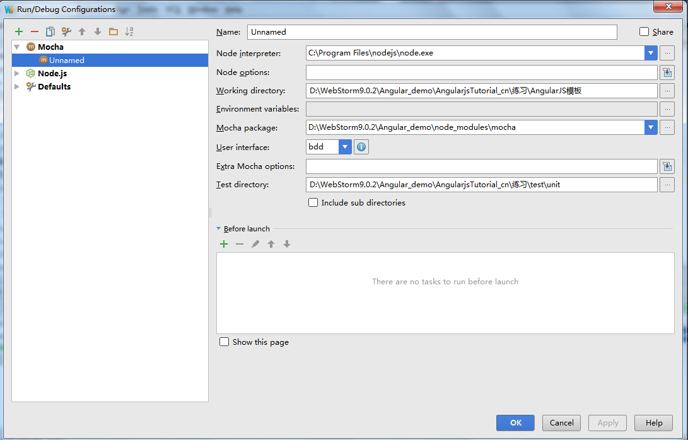

其实自己一直少一篇测试的文档，自己之前想过写一篇测试的文章，但是拖呀脱呀

## 测试驱动开发
* 什么是测试驱动开发？
    * 测试驱动开发（test-driven development,TDD）是一种敏捷（agile）开发方法论。
      它把开发流程倒转过来，在进行代码实现之前，首先保证编写测试用例，从而用测试来驱动开发。（而不是把测试作为一项验证工具来使用）
    * 测试驱动可以保证
        * 你所开发的代码可以有机的组织在一起，并且所编写的每一行代码都是目的明确的。
        * 你的代码可以保持高度模块化，高内聚，并且高度可复用（因为你必须能够测试它）
        * 提供了一个全面的测试用例集，从而可以避免将来造成损坏和bug。
        * 测试用例同时又是开发规范，并且是文档化，可以用于未来的需求和变更中。

## 测试框架karma


## 测试框架mocha 

## 断言工具should.js

### should.equal()
* 判断是否与某个特定的值相等

## 实际例子

### 测试一个函数返回的数组的长度为3
 在webstorm中的配置文件
 
```
function controllist_phones($scope){
    $scope.phones = [
        {"name": "Nexus S",
            "snippet": "Fast just got faster with Nexus S."},
        {"name": "Motorola XOOM? with Wi-Fi",
            "snippet": "The Next, Next Generation tablet."},
        {"name": "MOTOROLA XOOM?",
            "snippet": "The Next, Next Generation tablet."}
    ];

    return $scope;
}


module.exports=controllist_phones;
```
```
var controllist=require('../../AngularJS模板/controllist.js');
var should=require('should');

describe('controllist',function(){
    describe('#controllist_phones',function(){
        it('在controllist_phones的scope对象中应该有3个对象',function(){
            var scope = {};
            var ctrl =  controllist(scope);
            ctrl.phones.length.should.equal(3);
        });
    });
});
```

## 在chrome中使用Batarang调试


参考文献:
http://jingyan.baidu.com/album/f00622283d7ac5fbd3f0c83d.html

