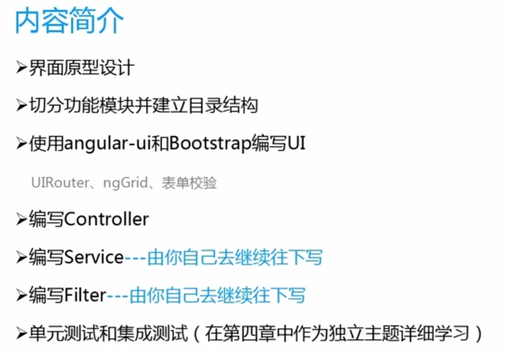
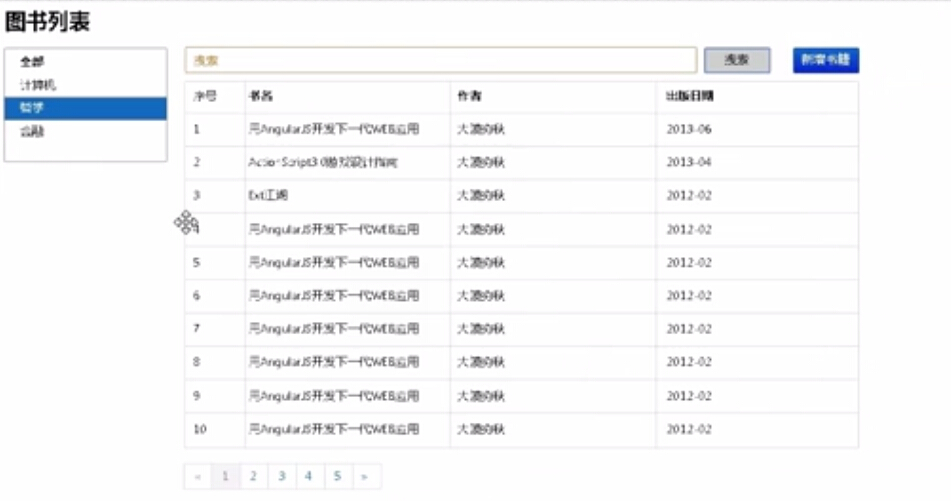
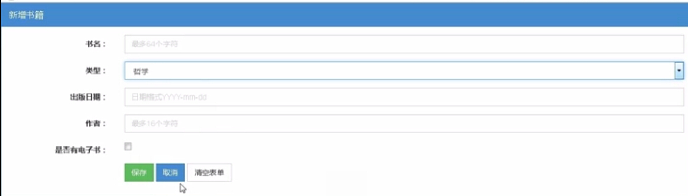
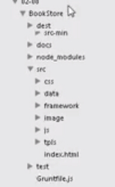

## 概述

## 界面原型设计
**使用工具**
archture-rp

**主页**

**图书列表页**

**新增书籍页**

**书籍详细信息页**

## 目录结构

**dest**
放我们最终编译出来的东西

**doc**
文档

**node_modules**
nodejs中的工具

**src**
存放我们的源代码

    * css
    * data
    * framework
    * images
    * js
    * tpls

**test**
存放测试代码

## 路由

需要准备的知识
ui-router
ng-grid

## 编写controller

**模块1**
booklist

**模块2*
bookdetail

## 编写filter
http://damoqiongqiu.iteye.com/blog/1920191

## 编写表单
**在angularjs中from是一个指令**
angularjs的一个特性是---单页面应用。在写表单的时候有点认识到这个特性了。
（ng-submit在默认情况下是阻止表单提交的）

**希望表单具有默认行为**
2：当在表单上使用了`action 属性`的时候`ng-submit`会放弃默认行为.但是这个时候又有新的问题出现。
后台不能获取数据.
在元素的form表单中，可以获取表单value上的属性值，但是在angularJS中这种方式好像不起作用了。
1.需要给input的name设定一个值，这样子我们就可以在后台获取特定的值。

**如果希望表单不在是一个指令**
`ng-pristine` 它会使得form成为一个原生的form

## 资源的引入
对于一个站点而言，其实我希望有些资源是一个全局的资源，在一个页面中使用了之后，还可以在其他的页面中进行使用。
我觉得这种方式是可以很大程度上提高页面的性能的。

每次加载一个页面，就去引入这个页面所需要的js，这个对于性能上是有很大的花销的。
其实公司平台就是一个单页面的引用系统。
当我的js文件特别多的时候，我就可以使用异步加载的方式去加载我的js，那样子会使得性能有较大的提升。

## http 重定向
302 代表的是http重定向。
如果在你的后台代码中使用了res.redirct(url)
这样子在前台球会返回一个重定向的statuscode

http://zhidao.baidu.com/link?url=rds4-MaLVD6Ex8ljRqumA147q273kOrOZ7Jjp4ZqVwnJEM9z-QXEcmsQyquQYQM8Qn8KByLZcU1qAhY7FWpdQK

参考文献：
http://www.imooc.com/video/4199

