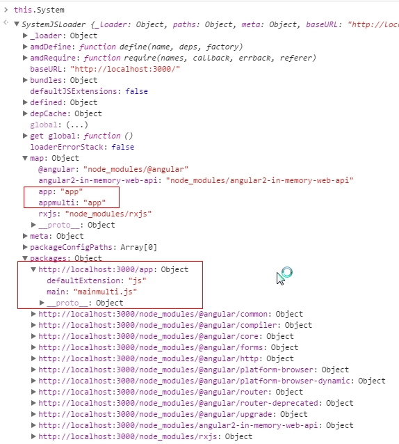

#### 问题

1访问http://localhost:3000/multi-heroes.html的加载过程。
1.1 首先引入multi-heroes.html的script标签所加载的所有js文件。
1.2 由于system.config.js中的函数是一个匿名自执行函数，因此会执行这个函数中的内容，由于`System.config()`
    1.2.1 对于map属性的处理
    如果存在map对象，则会遍历该对象上的每个属性p。并且读取与属性p对应的值v。
    ```
    loader.map[p] = v;
    ```
    1.2.2 对于packages对象的处理
    如果存在packages对象，则会遍历该对象上的每一个属性p。
    并且会调用coreResolve方法在loader对象上解析属性p，得到props
    通过属性p和packages获取到它的值pkg
    通过pkg对象，将合法的packages属性加载到
    ```
    extendMeta(loader.packages[prop], pkg);
    ```

应该是在
```
 <script src="node_modules/systemjs/dist/system.src.js"></script>
```




在system.config.js文件中
1.在HTML页面中import入了一个multiapp的component.它在System.map对象中查找这个component所在的文件夹app
2.然后在System.packages文件夹下查找在app文件夹下它的入口文件是哪一个
3.然后运行该文件夹的main文件或者如果没有main文件的话，直接的执行该文件。

备注
因此component所在的启动路径是在systemjs.config.js文件中进行配置的。
