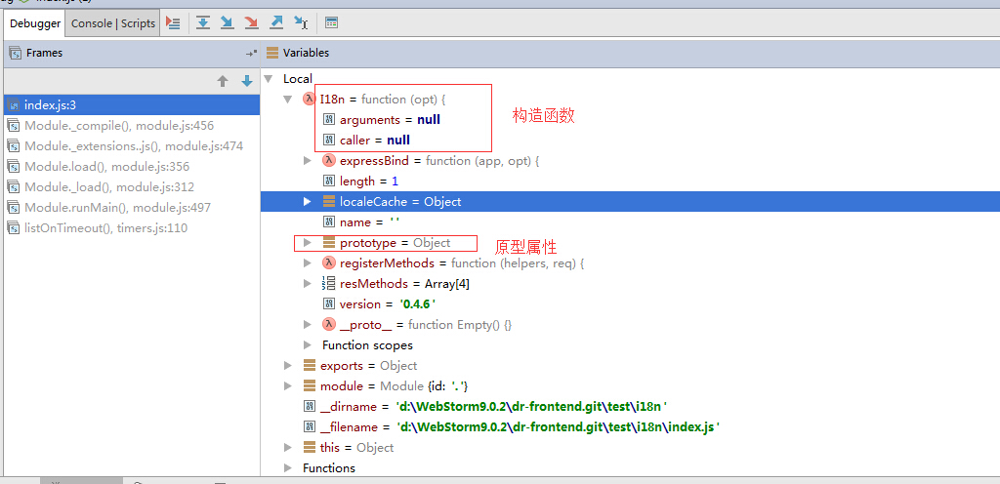
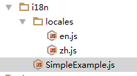

我觉得这个对象特别的奇怪

```javascript
var I18n = require("i18n-2");
console.log(typeof I18n );
```
断点调试

总之I18n这个对象的组成很复杂
1.构造函数
2.属性
3.方法
4.原型属性


## 问题
1：swig模块中是如何的读取locals文件夹下的内容？
nodejs中的路由信息
```
router.get('/i18n', function(req, res) {
  console.log(req);
  res.render('i18n', {
    desc: req.i18n.__("desc")
  });
});
```
zh.js文件中的内容
```
{
	"desc": "我们的"
}
```
html模板中的页面
```
<!DOCTYPE html>
<html>
<head lang="en">
    <meta charset="UTF-8">
    <title></title>
</head>
<body>

<p>{{ desc }}</p>

</body>
</html>
```
使用这种方式有一个有一个不好的地方在于

2:如何让整个的swig模块使用资源。


在前台读取的文件是这样子的。


发现：里面的内容给前台一个叫做resource的对象中去了。


## 注意事项
1:注意对象之间的使用次序
在app.js文件中
```
// Attach the i18n property to the express request object
// And attach helper methods for use in templates
i18n.expressBind(app, {
    // setup some locales - other locales default to en silently
    locales: ['en', 'de'],
    // change the cookie name from 'lang' to 'locale'
    cookieName: 'locale'
});
app.use(function(req, res, next) {
    //console.log(req);
    req.i18n.setLocaleFromCookie();
    console.log(req);
    next();
});
app.use('/', routes);
```
在这里一定要先与express绑定，然后再去设置一些其他的内容。


### 最简单的例子
```
// Load Module and Instantiate
var i18n = new (require('i18n-2'))({
    // setup some locales - other locales default to the first locale
    locales: ['zh', 'en']
});
// Use it however you wish
console.log( i18n.__("Hello!") )
```
运行完这段代码之后，会在当前目录下创建一个locals的文件夹



## API:

### `new i18n(options)`
**作用**
1.实例化一个`i18n`对象(是通过new实例化，或者是与expres一起使用来实例化的，比较特别！)
2.给i18n对象设置一些选项

**使用场合**
当你不需要使用`i18n.expressBind(app, options)`方法的时候

### `i18n.expressBind(app, options)`
**作用**
给express的req对象增加上一个`i18n`对象

这个是需要和express框架一起使用的。

### `__(string, [...])`
**作用**
1.根据目前的`local`去翻译一个字符串。
2.也支持`sprintf `语法的替换。这个的实现是通过`node-sprintf`模块来实现的。


### `__n(one, other, count, [...])`
根据count的值，来决定最后输出的是one,还是other.
js代码
```
var i18n = new (require('i18n-2'))({
    // setup some locales - other locales default to the first locale
    locales: ['zh', 'en']
});
var singular = i18n.__n('%s cat', '%s cats', 1);
var plural = i18n.__n('%s cat', '%s cats', 3);
console.log('singular:'+singular);
console.log('plural:'+plural);
```
输出结果：
```
singular:1 cat
plural:3 cats
```

### `getLocale()`
**作用**
返回local的值。如果没有指定local，则返回local的默认值。

### `setLocale(locale)`
**作用**
设置local的值

**需要注意的地方**
如果local文件夹下指定的local，不会抛出异常，而是把local指定为defaultlocal

### `setLocaleFromQuery([request])`
**作用**
在和其他框架（比如express）一起使用的时候，它会url后面添加上一些的`example.com/?lang=de`
那么我在后台会自动完成的一项工作是`setLocale('de')`

**如何使用**
request对象的query选项设置为true。

### `setLocaleFromSessionVar([request])`

### `setLocaleFromSubdomain([request])`
### `setLocaleFromCookie([request])`
### `setLocaleFromEnvironmentVariable()`
### `isPreferredLocale()`
这个不是特别的理解，反正返回的是一个布尔值。


## Configuration
### `locales`(必填)
`locales: ['en', 'de']`
1.数组中第一项自动的是`defaultlocal`


### `defaultLocale`
### `directory and extension`
**默认值**
默认目录是"./locales",默认的扩展文件是".js"

**注意事项**
1：production mode。一次性读取全部的文件，并缓存结果集。当在production mode的时候，对于字符串不允许更新。
2: 开发或者测试环境。i18n的每个实例对象会去读取locals文件夹下的文件。
新创建的字符串会自动的添加、写入到local文件夹中的json文件中。


### `base`
**作用**
对于local数组中的值进行处理。

**应用**
在特定的场合中有使用的需求，其他的情况下不怎么需要使用。

### `request, subdomain, query and session`
这个在express一起使用的例子中有的。

### `register`
**作用**
把`__, __n, getLocale, and isPreferredLocale方法`复制到`register`指定的对象上。
### `devMode`
这个的默认值的是false，你可以把这个的值指定为true
如果nodejs在正式的生产环境的时候，你可以把这个值指定为true。
### `indent`
**默认值**
是一个tab字符的长度

**应用场合**
当你需要更新`local files`文件中的内容的时候。


参考文献：
https://github.com/jeresig/i18n-node-2#using-with-expressjs