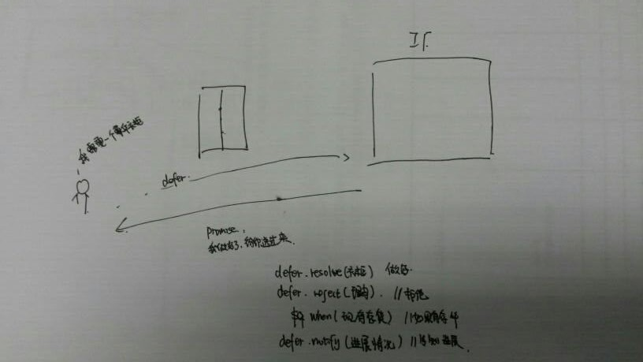

## 关于异步编程

在学习nodejs的时候异步编程就是一个难点。但是好在已经有了许多的框架。
1：在处理异步编程中已经有哪些解决方案？
    * 事件发布/订阅模式 
    * Promise/Deferred模式
    * 流程控制模式
2：在nodejs中自己最喜欢的异步编程的处理方式？
    * 使用第三方的模块：async模块，感觉这种方式更加的直观，而且使用起来比较方便。很喜欢这种方式。这种方式是流程控制方式中的一种。
    
## AngularJS是如何实现异步？
* 通过$q.其中$q是对Promise异步编程模式的一个简化实现版本。
* 在异步编程中最核心的就是回调了。因为有了回调函数，所以才构成了异步编程。
     * 1：什么之后执行回调：请求成功或者失败的时候
     * 2：执行什么回调：
     * 3： 回调执行的时候传入什么参数。


## 异步编程的解决方案
 
### Promise/Deferred模式


* 什么是defer对象
  * defer对象（延期对象）。代表异步执行体。
* 什么是Promise对象？
  * promise是对异步编程的一种抽象。它是一个**代理对象**，代表一个必须进行异步处理的**函数返回的值**或**抛出的异常**。
  * promise对象（承诺对象）代表回调执行体。


* 从callback到promise
  * 经典的callback
```
readFile(function (err, data) {
  if (err) return console.error(err)
  console.log(data)
})
```

  * 使用promise
```
var promise = readFile()
promise.then(console.log, console.error)
```
* promise的链接及内嵌
  * then方法的返回值---还是一个promise对象（这个有点像jquery）
```
readFile()
  .then(readAnotherFile)
  .then(doSomethingElse)
  .then(...)
```
  * 在promise中使用内嵌
```
readFile()
  .then(function (data) {
    return readAnotherFile().then(function () {
      // do something with `data`
    })
  })
```


#### 延迟接口 | Deferred API
通过调用  $q.defer() 可以构建一个新的 deffered 实例。
deffered 对象用来将 Promise 实例与 标记任务状态(执行成功还是不成功)的 API 相关联。
**deffered 对象的方法**
  * resolve(value) ――传入 value 解决派生的 promise。 如果 value 是一个通过 $q.reject 构造的拒绝对象(rejection) , 该promise 将被拒绝。
  * reject(reason) ――拒绝派生的promise,并提供原因 。 这相当于通过 $q.reject构造的拒绝对象(rejection)作为参数传递给 resolve。
  * notify(value)  ――在 promise 执行的过程中提供状态更新。 这在 promise 被解决或拒绝之前可能会被多次调用。
**deffered 对象的属性**
  * promise �C {Promise} ―― 与延迟(deferred)相关联的 promise 对象。

#### 承诺接口 | Promise API
当创建 deferred 实例时会创建一个新的 promise 对象,并可以通过  deferred.promise 得到该引用。
promise 对象的目的是在 deferred 任务完成时,允许感兴趣的部分取得其执行结果。
**promise 对象的方法**
* then(successCallback, errorCallback, notifyCallback) ――不管 promise 是被处理还是被拒绝, 一旦结果可用,then 就会尽快地异步调用 成功/错误 回调函数 只要结果是可用的。 调用回调函数时传递单个参数: 结果 或拒绝的理由。 此外,notify 回调可能被调用 0到多次,以提供 提供一个进度指示,之前承诺解决或拒绝。
           这个方法 返回一个新的promise 对象, 根据 successCallback , errorCallback的返回值进行解决或拒绝 。 它还通过 notifyCallback 方法的返回值进行通知。 promise 不能从notifyCallback方法得到解决或拒绝 。
* catch(errorCallback) ―― promise.then(null, errorCallback) 的快捷方式
* finally(callback) ――让你可以观察到一个 promise 是被执行还是被拒绝, 但这样做不用修改最后的 value值。 这可以用来做一些释放资源或者清理无用对象的工作,不管promise 被拒绝还是解决。 更多的信息请参阅完整文档规范.
            因为在 ES3版本的JavaScript中 finally 是一个保留字关键字,不能作为属性名,为了适配 IE8,您需要使用  promise['finally'](callback) 这种形式来调用该方法

###### 在promise中为什么有then？
* 前端程序员讨厌的代码
```javascript
fetchUser(function(user){
  fetchUserPermissons(user,function(permisson){
    fetchUserListData(user,permission,function(List){
    //对于你想要的数据进行处理
    })
  })
})
```
为了解决这个问题，promise方案提出了then的概念，在成功的时候执行一个函数，在出错的时候执行另外一个函数。这两个函数都可以进行链式
调用。
```
deferred.promise.then(fetchUser)
  .then(fetchUserPermissions)
  .then(fetchUserListData)
  .then(function(list){
  //处理数据列表
  },function(errorReason){
  //在任何一个地方发生错误，都可以在这里处理
  });
```
#### Promise/Deferred模式的优点和缺点
* 优点：Promise/Deferred模式的API接口和抽象模型都十分的简洁。
* 缺点：对于不同的场景，都需要去封装和改造Deferred部分。然后才能得到简洁的接口。

在CommonJS草案中已经抽象出了Promise/A、Promise/B，Promise/C,Promise/D这四种典型的异步Promise/Deferred模型。

#### 简单的例子
在html页面中
```
<!DOCTYPE html>
<html ng-app="Async">
<head lang="en">
    <meta charset="UTF-8">
    <title></title>
    <script src="../lib/angular.min.js"></script>
    <script src="controllist.js"></script>
</head>
<body>
<div ng-controller="promise">
</div>
</body>
</html>
```
在js代码中
```
var HttpREST=angular.module('Async',[]);
//基本例子
HttpREST.controller('promise',function($q,$http){
    /**
     * 1：创建一个defer对象
     * 2：创建一个defer对象对应的promise对象
     * 3：promise对象定义了成功回调函数，定义了失败回调函数
     * 4：对于promise发起通知
     * */
        //创建defer对象
    var defer=$q.defer();
    // 创建defer对象对应的promise对象
    var promise=defer.promise;
    //定义了成功之后的执行，和失败之后的执行
    promise.then(function(data){
        console.log('成功'+data);
    },function(data){
        console.log('失败'+data);
    });
    //对于promise发起通知
    defer.resolve('code_buny');
});
```

当调用defer.resolve('code_buny')的时候执行promise中成功的时候的回到函数，resolve函数中的参数就是回调成功执行的时候的参数。


    