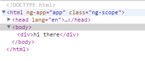

指令的作用：
* 扩展了HTML语法
* 把DOM和行为相关联。

>如果需要的dom都具有相同的行为，这个时候应该怎么把？

AngularJS内置的指令---共63个
  


### ng-app指令：

```
<html lang="en" ng-app>
```
* ng-app指令标记了AngularJS脚本的作用域，
    * ngApp指令来 ```自动``` 引导AngularJS应用
* 在```<html>```中添加ng-app属性即说明整个```<html>```都是AngularJS脚本作用域。
* 开发者也可以在局部使用ng-app指令，如```<div ng-app>```，则AngularJS脚本仅在该```<div>```中运行。

#### ng-app指令和模板一起使用
* 模块的作用
    * 一般是用于从服务器中拉一批数据出来

```
var shoppingModule=angular.module('ShoppingModule',[]);

shoppingModule.factory('Items',function(){
    var items={};
    items.query=function(){
        //在真实的应用中，这里是从服务器中拉数据下来的
        return [{
            name:'商品1',
            quantity:1,
            price:20
        },{
            name:'商品2',
            quantity:1,
            price:10
        },{
            name:'商品3',
            quantity:1,
            price:5

        }
        ];
    }
    return items;
});


//当Angular 创建ShoppingController 时，它会把$scope对象和刚定义好的Items服务作为参数传递过去
function ShoppingController($scope,Items){

    $scope.items=Items.query();

}
```

```
<html ng-app="ShoppingModule">
```
>这里ng-app的名称是ShoppingModule，而不是shoppingModule


### ng-repeat
```
  <li ng-repeat="phone in phones">
      {{phone.name}}
    <p>{{phone.snippet}}</p>
    </li>
```
* 作用：遍历作用域中数组或者对象，他和【in】一起使用,相当于程序中的循环分支
    * 在```<li>```标签里面的ng-repeat="phone in phones"语句是一个AngularJS迭代器。
这个迭代器告诉AngularJS用第一个```<li>```标签作为模板为列表中的每一部手机创建一个```<li>```元素。

#### ng-repeat指令和一些筛选器一起使用
* $index: 返回当前引用的元素序号,从0开始。
* $first：布尔值，判断当前元素是不是集合中的第一个元素
* $middle：布尔值，判断当前元素是不是集合中的中间元素
* $last：布尔值,判断当前元素是不是集合中的最后一个元素

```
    <ul>
        <li ng-repeat="student in students">
            {{student.name}}+{{$index}}
        </li>
    </ul>
```

```
<table ng-controller="RTC">
    <tr ng-repeat="res in directory" ng-click="sR($index)" 
    ng-class="{selected: $index==selectedRow}">
        <td>{{res.name}}</td>
        <td>{{res.cuisine}}</td>
    </tr>
</table>
```


### ng-controller
```
<body ng-controller="PhoneListCtrl">
```
* 参数:函数名称
* 作用:控制器的作用域,对于该标签内部的数据是有效的。
    * 在javascript中有两种作用域：全局作用域和函数作用域，这里和函数作用域类似
* 目的：当用户或视图进行交互的时候，它负责提供代码或者逻辑以便执行用户的想法。
>有两种主要的方式吧控制器关联到dom节点
1：ng-controller属性来声明
2：通过路由把它绑定到一个动态加载的DOM模板片段上。这个模板叫做视图。------这种方式目前还没有接触过。
    
### ng-module
```
 <input type="text" ng-model="query">
```
* 含义：1：当你在文本框中输入框中输入内容之后，会给某个controller中的$scope对象设置query属性变量的值。
        2：如果你在controller中的$scope对象设置query属性变量的值。则这个设置会反映到这个输入框上。
* 作用：数据绑定. 这是AngularJS的一个核心特性。当页面加载的时候，
AngularJS会根据输入框的属性值名字，将其与数据模型中相同名字的变量绑定在一起，以确保两者的同步性一个

* 使用范围：The ngModel directive binds an input,select, textarea (or custom form control) 
to a property on the scope using NgModelController, which is created and exposed by this directive.

* ng-module可以绑定input标签的value属性的值，但是它可以绑定span标签的text域中的值吗？
    * 好像不能，如果我需要创建一个变量绑定的是span标签文本域中的值，该如何创建？
    ng-model is not meant to be used with span. If you absolutely need that you can write a custom directive for this.
     This directive will set up a keydown,keyup listener on the contentEditable span and update the scope model 
     (within $apply()). This will bind span content to model.
     可以自己写一些监听器来实现。
     http://plnkr.co/edit/LYWUfgA35zQyestpiPdU?p=preview
     哇，高人无处不在呀！
    
    http://stackoverflow.com/questions/23528478/angularjs-ng-model-fails-on-span

### ng-bind
```
<p ng-bind="greeting"></p>
```
* 作用:UI中的任何地方显示并刷新文本。（有点像在获取变量的值）

* {{}} 与ng-bind命令的区别
    * 习惯上。{{}}阅读更加的自然，而且需要输入的内容比较少
    *  首页：在首页中一般要使用ng-bind ,如果使用{{}}可能会造成。未被渲染好的页面被用户看到
    * 原因：浏览器先加载html，渲染它，然后再用Angular。
    
### ng-change
```
<form ng-controller="StartUpController" >
    <input type="text" ng-model="f.input" ng-change="ch()" />
     recommendation:<span ng-bind="f.input*10"></span>
</form>
```

```
function StartUpController($scope){
    $scope.f={input:0};
    $scope.ch=function(){
        $scope.f.output= $scope.f.input*10;
    }
}
```
* 作用：为change事件指定处理函数

#### ng-change指令与$scope.$watch()的区别？

### ng-submit 
* 含义：1：当表单提交的时候执行这个函数
        2：自动阻止浏览器执行默认的POST操作。
        
###  ng-click
* 含义：和onclick事件类似
* 我希望在表单提交的时候使用该方法
* 我希望在表单验证通过之后使用该方法

     
### ng-dbclick
* 含义：和ondbclick事件类似

### ng-show 或ng-hidden
* ng-show含义：在表达式为true的时候显示元素，表达式为false的时候隐藏元素
* ng-hidden含义：在表达式为false的时候显示元素，在表达式为true的时候显示元素。
```
<div ng-controller="toggleController">
    <input type="button" ng-click="ch()" value="显示或隐藏"/>
    <p ng-show="meauState">显示</p>
</div>
```

```
function toggleController($scope){
    $scope.meauState=true;
    $scope.ch=function(){
        $scope.meauState=!$scope.meauState;
    }
}
```

### ng-class 
* 作用：给满足条件的标签添加class

```
<table ng-controller="RTC">
    <tr ng-repeat="res in directory" ng-click="sR($index)"
     ng-class="{selected: $index==selectedRow}">
        <td>{{res.name}}</td>
        <td>{{res.cuisine}}</td>
    </tr>
</table>
```

```
function RTC($scope){
    $scope.directory=[{name:'dddd',cuisine:'bbq'},
        {name:'cccc',cuisine:'iiii'},
        {name:'ss',cuisine:'qqq'}];
    $scope.sR=function(row){
        $scope.selectedRow=row;
    }
}
```

```
.selected{
  background-color:lightgreen;
}


```
* ng-class="{selected: $index==selectedRow}的含义
    * 如果$index==selectedRow的值相同，则给ng-class所在的标签添加selected类
    * $index、selectedRow是当前作用域可以访问到的变量。
    * 在ng-reqeat外部肯定是不可以访问到$index,因此在AngularJS中，不仅用ng-controller形成了一个作用域，
    使用ng-repeat也形成了作用域的。
* 上面这段代码的作用？
    * 当单机表格中的一行的时候，这一行变成绿色。
    
### ng-src 和ng-href
* 问题：在或者<a>标签上进行数据绑定的时候，在src或者href 属性还是那个简单的使用{{}} ```无法很好的运行```
* 我试过之后，对于图片如果使用了数据绑定，直接使用src 属性也能得到想要的结果，但是在控制台中会有一些错误信息。
    * 浏览器会优先的使用并行的方式来加载图片和其他的内容，所以angular没有机会拦截到数据绑定的请求。
```
<div ng-controller="imgController">
     
</div>
```
>错误不可以再现

### ng-view
* 作用：告诉angular把`视图`放在那儿显示。

### ng-disabled
* 作用.设置一个控件是不是可以使用
* 例子：
```
<form ng-controller="AddUserController" name="addUserForm">
    <div>{{message}}</div>
    <ul>
        <li>First Name<input type="text" ng-model="user.first" required/></li>
        <li>Last Name <input type="text" ng-model="user.last" required/></li>
        <li>Email <input type="email" required/></li>
        <li>Age<input type="text"/></li>
        <li> <button ng-click="addUser()" ng-disabled="!addUserForm.$valid" >submit</button></li>
    </ul>
</form>
```

>$valid属性获取表单的校验状态，它不是通过html5中的required关键字获取的，而是通过angularJS中的ng-model中的孩子获取的。

### ng-maxlength
* 作用：控制最大值

### ng-minlength
* 作用：控制最小值

### ng-Resource
* 它是一个独立的，可选的模块
* 使用这个模块之前的准备工作
    * 在加载的脚本文件中包含angular-resource.js
    * 在模块依赖声明中包含ngResource(such as: angular.module('myModule',['ngResource']))
    * 在需要的地方注入$resource服务
    
### form指令


## 第三方指令

http://angular-ui.github.io/


## 自定义指定
* 使用场合
    * 当你想要用某种方式处理浏览器事件或者修改DOM,而这些东西又没有内置指令可以支持的时候，
    你就需要深入理解指令系统了。
    
在angular.module对象 中有一个directive()
   directive(name,directiveFactory)
   
   * name:
       * 参数为[string]或者[Object]
   * directiveFactory：
       * 用于创建指令的工厂函数。
       
       
#### AngularJS指令执行的三个阶段
**指令是如果被整合到AngularJS的启动和运行生命周期中**
    
   

#### 指令的API
**restrict**
 描述了指令在模板中的使用方式。包括：元素（element）属性（attribute）css样式类（class）注释（comment）。
              或者以上几种方式的任意组合
```
字母         声明风格   示例
E            元素       <hello></hello>
A（默认）    属性       <div hello></div>
C           样式类     <div class="hello"></div>
M           注释       <!-- directive:hello -->  //空格
```

* 创建指令的原则
    * 推荐使用元素和属性的方式来创建指令
    * 当需要创建待有自己的模板的指令的时候，使用元素的方式来创建指令
    * 当需要为已有的html标签呢增加功能的时候，使用属性的方式来创建指令
    
**template**
    以字符串的形式来编写一个内联模板。如果以URL的方式提供模板，这个属性会被忽略
 
**templateUrl**
     描述加载模板所在的URL。如果使用字符串的形式提供内联内联的模板，此属性会被忽略
     
**replace**
     如果此配置项为true，则`替换`指令所在的元素，如果为false或者不指定。则把当前指令`追加`到所在元素的内部。

**transclude**
     把指令元素中原来的子节点移动到一个新模板内部。
     当此属性设置为true的时候，指令会删除原来的内容，使你的模块可以用`ng-transclude`指令进行重新插入。
     
**link**
     使用编程的方式修改最终生成的`DOM元素实例`。添加事件监听器，并设置数据绑定。

**complie**
    在使用ng-repeat时，用编程的方式修改DOM模板，从而实现同一个指令的跨域多个实例的特性。compile函数也可以返回一个link函数。
    可以用它来修改阐述的元素实例。
    
**scope**
    为当前指令创建一个新的作用域，而不是使之继承父作用域
    
scope对象的类型    
```
Scope类型               语法
现有的scope(默认值)    scope:false(如果不指定，这就是默认值)  //指令对应的DOM元素上存在的scope对象
新scope               scope:true   // 继承了外层控制器的scope
独立scope             scope:{/* 属性名和绑定风格   */}
```
当创建独立scope的时候，默认情况下是不可以访问父scope模型中的任何东西。但是你可以指定某些属性传递到你的指令中，你可以把这些
属性名称看成函数的形参。
scope的绑定策略
```
符号  含义
@     把当前属性作为字符串传递，你还可以绑定来自外层scope的值，在属性值中插入{{}}即可
=     绑定当前属性，它带有一个来自指令父scope的属性，`双向绑定`
&     传递一个来自父scope的函数，稍后调用
```
@绑定传递的是一个字符串
在自己写绑定策略`=`的时候，一直报错，先把这个坑留着吧

在`link函数`中有一个`形参scope`，这个属性的设定，将会影响到link函数中的scope形参
    
**controller**
    创建一个作用域，他会暴露一个API(public方法)，利用这个API可以实现多个指令之间进行通信
    
* 语法
    controller:function controllerConstuctor($scope,$element,$attr,$transclude)
    controller函数是通过`依赖注入`
* 把控制器传递给其他指令
    eg：require:'^?direcitveName'
    
**require**
    要求必须存在另外一个指令，当前指令才能运行。
    
* eg：require:'^?direcitveName'
    `^`默认情形下，Angular会从同一个元素上的命名指令中获取控制器。添加上这个`^`符号的意思，需要同时遍历DOM树去查找指令。
    `?`如果没有找到所需要的控制器，Angular将会抛出异常，告诉你问题所在。在字符串中添加一个`?`号的意思是说这个控制器是可选的。
    如果没有找到，不需要抛出异常，
    
**那些内容应该放在controller中，那些内容应该要放在link中**
>如果说你需暴露一些API的话，你把这些内容放在controller中，如果你需要做事件的监听操作的话，你把这些内容放在link中

**为什么需要独立scope，独立scope如何创建？**
>创建独立scope可以让新创建的指令之间没有依赖，独立scope的创建`scope:{}`
     
     

##### 与指令有关的demo---`replace:true`

`replace:true` 只能保证`hellow标签`是否存在。
如果hello标签`内部有内容`，如果没有进行`transclude`设置，则hello标签的内部全部替换。
也就是说replace:true它并没有设定权利去保障hello便签内的内容是否存在。

html代码
```
<!DOCTYPE html>
<html ng-app="app">
<head lang="en">
    <meta charset="UTF-8">
    <script src="../../lib/angular.min.js"></script>
    <script src="controllerlist.js"></script>
    <title></title>
</head>
<body>
<hello></hello>

</body>
</html>
```
js代码
```
/**
 * 1:创建一个angularJS的应用app
 * 2：给这个angularJS的应用创建一个hello指令
 * 3：设定这个是一个元素指令，模板是中的内容是Hi there
 * */

var appModule=angular.module('app',[]);
appModule.directive('hello',function(){

    return {
        restrict:'E',
        template:"<div>hi there</div>"
    }
})
```
可以看到最后hello标签依然存在。


如果我修改js代码
```
var appModule=angular.module('app',[]);
appModule.directive('hello',function(){
    return {
        restrict:'E',
        template:"<div>hi there</div>",
        replace:true

    }
})
```

 
##### 与指令有关的demo---`templateUrl`
js代码
```
var appModule=angular.module('app',[]);
appModule.directive('hello',function(){

    return {
        restrict:'E',
        templateUrl:"helloTemplate.html",
        replace:true

    }
})
```

html代码
```
<!DOCTYPE html>
<html ng-app="app">
<head lang="en">
    <meta charset="UTF-8">
    <script src="../../lib/angular.min.js"></script>
    <script src="controllerlist.js"></script>
    <title></title>
</head>
<body>
<hello></hello>

</body>
</html>
```
helloTemplate.html中的代码
```
<div>hi there</div>
```
最后的运行效果和上面一样的。

##### 与指令有关的demo---`$templateCache`
js代码
```
var appModule=angular.module('app',[]);

appModule.run(function($templateCache){
    $templateCache.put('helloTemplateCached.html','<div>hi there</div>');
});

appModule.directive('hello',function(){

    return {
        restrict:'E',
        templateUrl:"helloTemplateCached.html",
        replace:true

    }
})

```
html代码和上面相同
最后的效果也和上面相同
**angular.run()**
当注射器加载了所有的模块之后，这个方法会被执行一次。

**使用$templateCache的优点**
减少了get请求的次数

##### 与指令有关的demo---`transclude`
html代码
```
<!DOCTYPE html>
<html ng-app="app">
<head lang="en">
    <meta charset="UTF-8">
    <script src="../../lib/angular.min.js"></script>
    <script src="controllerlist.js"></script>
    <title></title>
</head>
<body>
<hello>
    <div>wwww</div>
</hello>
</body>
</html>
```
js代码
```
var appModule=angular.module('app',[]);
appModule.directive('hello',function(){
    return {
        restrict:'E',
        template:"<div>hi there<span ng-transclude></span></div>"  ,
        transclude:true
    }
})
```
最后的效果


它保留了指令内部原来存在的一些标签

##### 与指令有关的demo---`指令与单个控制器交互`
html页面
```
<!DOCTYPE html>
<html ng-app="app">
<head lang="en">
    <meta charset="UTF-8">
    <script src="../../lib/angular.min.js"></script>
    <script src="controllerlist.js"></script>
    <title></title>
</head>
<body>

<div ng-controller="DataCtrl1">
    <hello></hello>
</div>

</body>
</html>
```

js文件
```
var appModule=angular.module('app',[]);
appModule.controller('DataCtrl1',function($scope){
    $scope.loadData=function(){
        console.log("加载数据中");
    }

});
appModule.directive('hello',function(){
    return {
        restrict:'E',
        templateUrl:"helloTemplate.html",
        replace:true,
        link:function postLink(scope,iElement,iAttr){
            iElement.bind("mouseenter",function(){
                scope.loadData();
            });

        }
    }
})
```
最后的效果

   
   
##### 与指令有关的demo---`指令与多个控制器交互`
html代码
```
<div ng-controller="DataCtrl1">
    控制器1：
    <hello howToLoad="loadData()"></hello>
</div>

<div ng-controller="DataCtrl2">
    控制器2：
    <hello howToLoad="loadData2()"></hello>
</div>
```

js代码
```
var appModule=angular.module('app',[]);
appModule.controller('DataCtrl1',function($scope){
    $scope.loadData=function(){
        console.log("加载数据中");
    }
});

appModule.controller('DataCtrl2',function($scope){
    $scope.loadData2=function(){
        console.log("加载数据中222");
    }
});
appModule.directive('hello',function(){
    return {
        restrict:'E',
        templateUrl:"helloTemplate.html",
        replace:true,
        link:function postLink(scope,iElement,iAttr){
            iElement.bind("mouseenter",function(){
                /**
                 * 1:获取标签属性 iAttr.howToLoad
                 * 2：调用相应的方法
                 * 3:特别注意--属性要小写
                 * */
                scope.$apply(iAttr.howtoload);
            });

        }
    }
})
```
最后的效果


**总结**
通过`指令属性`，就可以实现指令与多个控制器之间的交互

`注意`
使用指令的属性的时候，要全部的使用小写，这是一个坑。
```
scope.$apply(iAttr.howtoload);
```   

##### 与指令有关的demo---`多个指令之间进行交互`
html页面
```
<div>
    超人+力量：<superman strength></superman>
</div>
<div>
    超人+力量+速度：<superman strength speed></superman>
</div>
<div>
    超人+力量+速度+光：<superman strength speed light></superman>
</div>
```

js页面
```
/**
 * 1:创建4个指令 superman strength speed  light
 * 2:在superman指令的controller中暴露了3个方法 addStrength addSpeed addLight
 * 3:在superman的scope中创建独立的作用域
 * 4：在superman的link函数中比较简单，给元素绑定mouseenter事件主要是用来打印scope.abilities
 *
 * */


var appModule=angular.module('app',[]);

appModule.directive('superman',function(){
    return {
        restrict:'AE',
        templateUrl:"helloTemplate.html",
        replace:true,
        scope:{},
        controller:function($scope){
            $scope.abilities=[];
            this.addStrength=function(){
                $scope.abilities.push('strength');
            }
            this.addSpeed=function(){
                $scope.abilities.push('speed');
            }
            this.addLight=function(){
                $scope.abilities.push('light');
            }
        },
        link:function postLink(scope,iElement,iAttr){
            iElement.bind("mouseenter",function(){
                console.log(scope.abilities);
            });
        }
    }
});
appModule.directive('strength',function(){
    return {
        require:'?superman',
        link:function postLink(scope,iElement,iAttr,supermanController){
            supermanController.addStrength();
        }
    }
});
appModule.directive('speed',function(){
    return {
        require:'?superman',
        link:function postLink(scope,iElement,iAttr,supermanController){
            supermanController.addSpeed();
        }
    }
});
appModule.directive('light',function(){
    return {
        require:'?superman',
        link:function postLink(scope,iElement,iAttr,supermanController){
            supermanController.addLight();
        }
    }
});
```
最后的效果
页面效果

把鼠标移动到页面之后的控制台效果


##### 与指令有关的demo---`为什么需要独立scope`
html代码
```
    第一个：<hello></hello>
    第二个：<hello></hello>
    第三个：<hello></hello>
    第四给：<hello></hello>
```
js代码
```
var appModule=angular.module('app',[]);
appModule.directive('hello',function(){
    return {
        restrict:'E',
        templateUrl:"helloTemplate.html",
        replace:true
    }
})
```
helloTemplate.html中代码
```
<div ><input type="input" ng-model="ww" /></div>
```
最后的效果---页面


我只是在第一个文本框中输入了内容，结果其他的三个文本框中内容也发生了变化
这是由于scope的默认值是指令对应的DOM元素上存在的scope对象。

* DOM元素上存在的scope对象。


* 独立scope。

父元素上的scope


##### 与指令有关的demo---`独立scope---绑定策略@`
html代码
```
<div ng-controller="DataCtrl1">
    指令中的内容：
    <hello flavor={{ctrlFlavor}}></hello>
    控制器中的内容
    <input type="text" ng-model="ctrlFlavor" />
</div>
```
js中的代码
```
var appModule=angular.module('app',[]);
appModule.controller('DataCtrl1',function($scope){
    $scope.ctrlFlavor="百威";

});
appModule.directive('hello',function(){
    return {
        restrict:'E',
        templateUrl:"helloTemplate.html",
        replace:true,
        scope:{
            flavor:'@'
        },
        link:function postLink(scope,iElement,iAttr){

        }
    }
})
```
helloTemplate.html中的代码
```
<div><input type="text" ng-model="flavor" /></div>
```

在controller中修改变量
* 独立scope。

在独立scope中修改变量


**总结**
* 使用@绑定策略，父对象的可以影响子对象，但是子对象的修改，不会影响父对象。

##### 与指令有关的demo---`独立scope---绑定策略&`
HTML代码
```
<div ng-controller="DataCtrl1">
<hello greet="greetingA(name)"></hello>
    <hello greet="greetingA(name)"></hello>
    <hello greet="greetingA(name)"></hello>
</div>
```
js代码
```
var appModule=angular.module('app',[]);
appModule.controller('DataCtrl1',function($scope){
    $scope.greetingA=function(name){
        alert('hello'+name);
    };

});
appModule.directive('hello',function(){
    return {
        restrict:'E',
        templateUrl:"helloTemplate.html",
        replace:true,
        scope:{
            greet:'&'
        },
        link:function postLink(scope,iElement,iAttr){

        }
    }
})
```

helloTemplate.html代码
```
<div><input type="text" ng-model="username" />
    <button type="button" ng-click="greet({name:username})" >hello</button>
</div>
```
* 页面效果

点击页面上的元素

* 总结
1：方法参数的传递，需要使用`ng-click="greet({name:username})"`


   参考文献：
   http://www.imooc.com/video/2948
    
    
    


