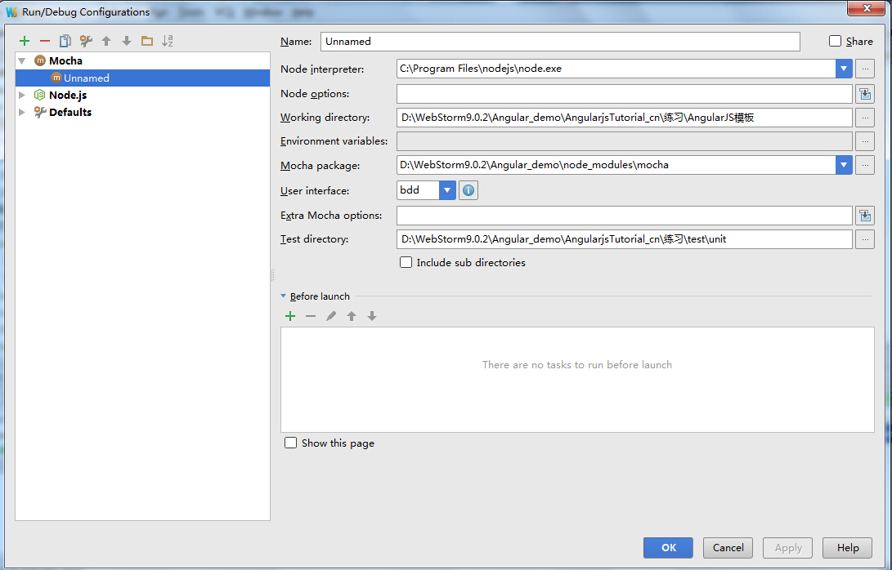

其实自己一直少一篇测试的文档，自己之前想过写一篇测试的文章，但是拖呀脱呀

## 需求驱动开发和行为驱动开发之间的区别


## 测试框架mocha 

## 断言工具should.js

### should.equal()
* 判断是否与某个特定的值相等

## 实际例子

### 测试一个函数返回的数组的长度为3
 在webstorm中的配置文件
 
```
function controllist_phones($scope){
    $scope.phones = [
        {"name": "Nexus S",
            "snippet": "Fast just got faster with Nexus S."},
        {"name": "Motorola XOOM? with Wi-Fi",
            "snippet": "The Next, Next Generation tablet."},
        {"name": "MOTOROLA XOOM?",
            "snippet": "The Next, Next Generation tablet."}
    ];

    return $scope;
}


module.exports=controllist_phones;
```
```
var controllist=require('../../AngularJS模板/controllist.js');
var should=require('should');

describe('controllist',function(){
    describe('#controllist_phones',function(){
        it('在controllist_phones的scope对象中应该有3个对象',function(){
            var scope = {};
            var ctrl =  controllist(scope);
            ctrl.phones.length.should.equal(3);
        });
    });
});
```

