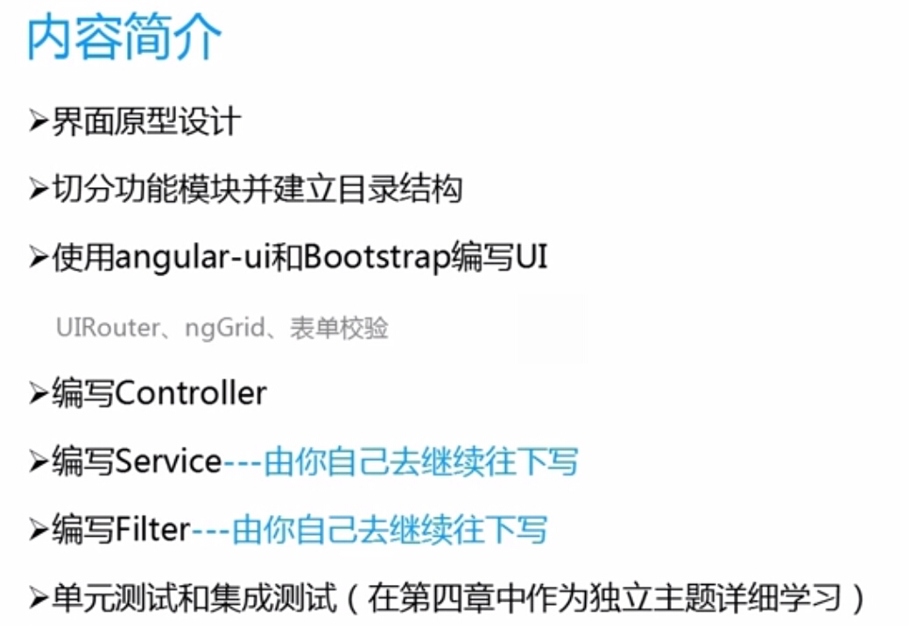
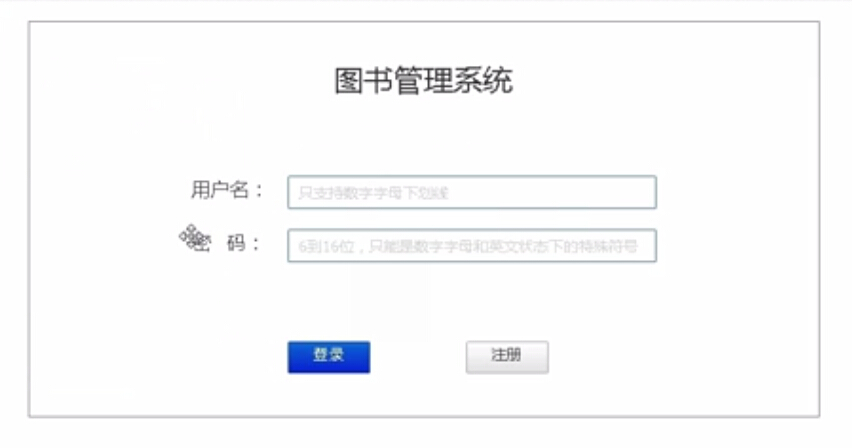
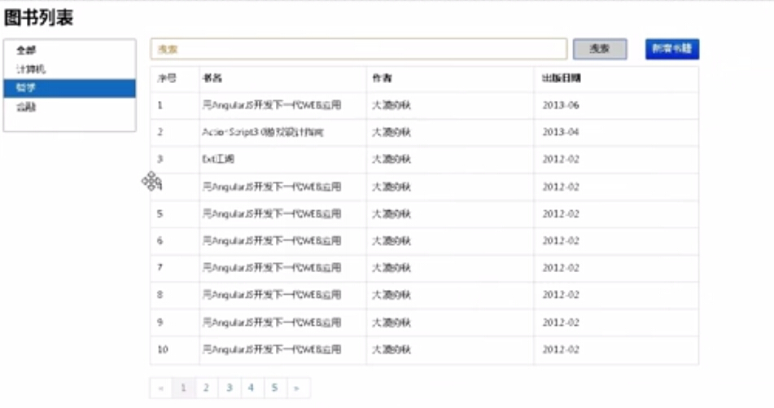
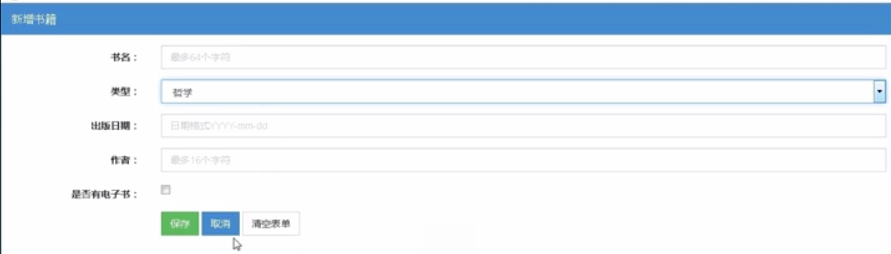
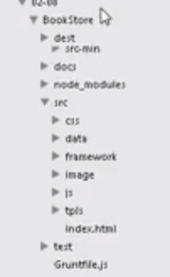

## 概述

## 界面原型设计
**使用工具**
archture-rp

**主页**

**图书列表页**

**新增书籍页**

**书籍详细信息页**

## 目录结构

**dest**
放我们最终编译出来的东西

**doc**
文档

**node_modules**
nodejs中的工具

**src**
存放我们的源代码

    * css
    * data
    * framework
    * images
    * js
    * tpls

**test**
存放测试代码

## 路由

需要准备的知识
ui-router
ng-grid

## 编写controller

**模块1**
booklist

**模块2*
bookdetail

## 编写filter
http://damoqiongqiu.iteye.com/blog/1920191
http://damoqiongqiu.iteye.com/blog/1920993

参考文献：
http://www.imooc.com/video/4199

